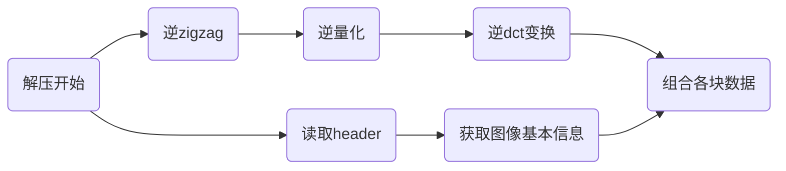

实现简单的无编码的jpeg压缩。

压缩与解压缩流程图如下:





### padding
我们首先要对图像进行padding,以便接下来我们对图像进行分割成:$n\times 8\times 8$的块，所以先对图像进行padding.

padding有多种方式，这边我们选择补与最后一行（列）相同的值。

当然我们也可以选择补0；


###分割
padding 完成之后，我们对整个图像进行分割
可以采用$matlab$ 自带函数：mat2cell  以及复原时候的cell2mat 
https://blog.csdn.net/u010099080/article/details/50499828

这边我们用for循环实现
``` matlab
block(:,:,idx)=i(((j-1)*8+1:(j-1)*8+8),((k-1)*8+1:(k-1)*8+8))
```

### DCT变换
离散余弦变换
$r(x,y,u,v)=s(x,y,u,v)=\alpha(u)\alpha(v)cos[\frac{(2x+1)u\pi}{2n}]cos[\frac{(2y+1)v\pi}{2n}]$

在$matlab$的函数库中，有dct2函数 以及idct2函数
当然也可以自己实现：
一维:


```matlab
in=1:8;
N=8;
for i=0:N-1
if i==0
    a=sqrt(1/N);
else
    a=sqrt(2/N);
end 
sum=0;
for j=0:N-1     
    sum=sum+in(j+1)*cos(pi*(j+0.5)*i/N);
end
F(i+1)=a*sum;
end
```

这边我们用系统自带的函数$dct2$进行dct变换

### 量化
量化矩阵Z,这是一个标准阵

```matlab
>  [[16,11,10,16,24,40,51,61]
   [12,12,14,19,26,58,60,55]
    [14,13,16,24,40,57,69,56]
    [14,17,22,29,51,87,80,62]
    [18,22,37,56,68,109,103,77]
    [24,35,55,64,81,104,113,92]
    [49,64,78,87,103,121,120,101]
    [72,92,95,98,112,100,103,99]];
```

$Qblock = round(\frac{block}{K*Z})$ ,$K$是压缩系数

进行量化之后，我们进行zigzag排序，将矩阵转化成数据流。

同样的 逆变换也是如此 $block = Qblock.*K*Z$

### zigzag排序

我们采用一个固定的$8\times8$的zigzag函数 

``` matlab
function y=zigzag(a)
    zz=[1,2,9,17,10,3,4,11,18,25,33,26,19,12,5,6,13,20,27,34,41,49,42,35,28,21,14,7,...
 8,15,22,29,36,43,50,57,58,51,44,37,30,23,16,24,31,38,45,52,59,60,53,46,39,32,...
40,47,54,61,62,55,48,56,63,64];
    aa = reshape(a,1,64);%转化成数据流
    y=aa(zz);% 数据流中的第zz个是对应的y中的
end
```

在解压时候，我们也同样的采用这个方法，得到izigzag函数.
### 输出数据流
理论上来说，我们到此时已经完成了整个压缩过程，但是为了能够解压缩，必须添加一些信息。
header结构可以如下：

> 原图大小+padding后大小+压缩系数+填充

此外，在各zigzag序列前，我们需要添上一项以衡量这个非零zigzag序列长度，以便于我们解压缩时候，找到对应的block.

至此我们的压缩过程就已经结束了。


### 一些分析

我们来看几组不同k值时候的输出。

When K=1:

时间已过 1.720469 秒。

PSNR:                 45.3306
Original Bit:         4718592 bit
Compressed Bit:       288368 bit
Compression Ratios:   16.3631


When K=5:

时间已过 0.476951 秒。

PSNR:                 36.5716
Original Bit:         4718592 bit
Compressed Bit:       161664 bit
Compression Ratios:   29.1876


When K=10:

时间已过 0.476694 秒。

PSNR:                 31.4891
Original Bit:         4718592 bit
Compressed Bit:       129600 bit
Compression Ratios:   36.4089


我们可以看到随着K的增加，压缩率明显地增加，但压缩使用时间减少，并且此时解压缩得到的图片质量也不断地降低。K不是太大的时候，图像解压缩得到的效果比较好并且，压缩率也在16%以上

误差的来源在于，在量化过程中，我们损失了一部分精度，而在逆量化过程中，我们也损失的一部分精度，其他步骤并没有损失精度。


-----------


### 附录:一些遇到的问题

#### 矩阵除法

数值预算时候 $/$与$./$ 没有区别

数值与矩阵运算时
数值在前，只能用$./$
数值在后，两者没有区别

矩阵与矩阵运算时
$A/B=A*inv(B)$
$A./B$表示对位相除

question im2double